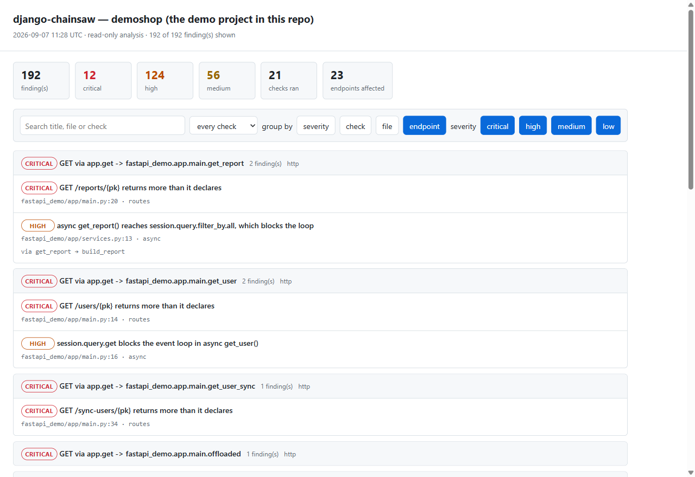

# django-chainsaw-mcp


An MCP server and CLI that **analyses** a Django project rather than
describing it. A handful of the checks reach past Django — one needs nothing
but Python, one reads FastAPI routes, one reads SQLAlchemy — and the rest read
the app registry.

Several Django MCP servers already exist. They answer *what exists*: list the
models, dump the schema, run the ORM, read the settings. None of the ones I
looked at answer *what will hurt*:

- what a delete actually takes with it,
- where the N+1 queries are,
- which pending migration stops writes or breaks the code that is still running
  during a rolling deploy,
- whether a destructive migration is safe to ship **yet**,
- which queries read tenant-scoped rows without scoping the query,
- what a single `save()` actually sets off, three hops away,
- which endpoint a stranger can use to make the database do three thousand
  queries,
- which of three hundred findings a request can actually reach, and through
  which endpoint,
- which `filter(status="cancelled")` the `choices` will never match, returning
  zero rows and raising nothing,
- which `reverse()` call, template, signal receiver or scheduled task points at
  a name that no longer exists,
- which dashboard number is the product of two joins rather than the count it
  claims to be.

Everything is read-only, and most of it never touches the database.

**On the name.** It is a Django tool, and the name is not a historical
accident to apologise for: of the 21 checks in the aggregate run, **18 need the
app registry**. One needs only Python, one is FastAPI-specific and one is for
SQLAlchemy. The reach beyond Django is real and it is small, which is what the
two tables below say.

An earlier version of this paragraph claimed the name stays because renaming
the repository would break every link to it. That is not true — GitHub
permanently redirects a renamed repository — and it was the wrong reason for
the right conclusion. The name stays because it is accurate.

## Or as one HTML file

```bash
django-chainsaw report --out findings.html --title myproject
```

Every finding in a single self-contained page: filter by severity, search, and
group by **endpoint**, check, file or severity.



Grouped by endpoint is the view that matters: *which pages carry this, and
through what call path*. No server, no network, no build step - the CSS, the
script and the data are all in the file, so it works from a CI artifact or an
email attachment. Details: **[docs/report.md](docs/report.md)**.

## What it runs, and what it does not

Read this before pointing it at a codebase.

**It imports the target project.** `django.setup()` imports your settings and
every app in `INSTALLED_APPS`, and the checks additionally import the modules
that declare serializers, views and URLs. Anything those modules do at import
time therefore happens: a module-level API call happens, a connection opened in
`apps.py` is opened. That is not a design choice this can avoid - the app
registry is where the answers are - but it does mean **do not point this at code
you would not run**.

**It does not run your application.** No view is called, no task is dispatched,
no management command is executed.

**One check reads the database, read-only.** `migrations` and `deploy-safety`
ask Django's own `MigrationLoader` which migrations are applied, which reads the
`django_migrations` table. Nothing else opens a connection, and nothing writes
to your database. No migration is applied and no row is touched.

**It writes files only when you ask.** `fix --write` edits your source, and only
the mechanical class of fix. A baseline, an API-contract snapshot and `--sarif`
each write where you tell them to. Otherwise nothing is written.

**Nothing leaves the machine.** No network calls, no telemetry, no uploads.

## One command to try it

```bash
django-chainsaw check --tenant-root myapp.Organisation
```

```
44 finding(s): 1 critical, 14 high, 29 medium

CRITICAL
--------
  [deploy-safety] RemoveField drops 'legacy_code' while code still uses it
      shop/0002_remove_product_legacy_code
      During a rolling deploy the old pods keep running against the new
      schema and will fail.
      fix: Ship a release that stops using it, deploy that everywhere,
           then ship this migration.
```

Every analysis, merged, worst first, one exit code. `--sarif out.json` writes
the same findings in the format GitHub and GitLab annotate a pull request with,
so they land **on the line** instead of in a log nobody opens.

Five minutes end to end: **[docs/quickstart.md](docs/quickstart.md)**.

## Two front ends, one analysis layer

| | For |
| --- | --- |
| **MCP server** | asking questions while working, from Claude Code or any MCP client |
| **`django-chainsaw` CLI** | the same checks with an exit code, so CI can gate on them |

## Tools

### Django projects

These read the app registry, so they need `DJANGO_CHAINSAW_SETTINGS_MODULE` as
well as the project path.

| Tool | Answers |
| --- | --- |
| `project_info` | Does the target project load at all? Run this first when something is broken. |
| `list_models` | Every model with fields, relation kind, direction and `on_delete`. |
| `delete_impact` | Delete one row: what cascades, what blocks, what gets nulled. Transitive. |
| `find_n_plus_one` | Relation traversals in a template that each cost a query, and the fix. |
| `scan_templates` | The same across a directory, resolving context from views. |
| `migration_risk` | Migrations rated: blocks writes, rewrites the table, breaks running code. |
| `deploy_safety` | **Is this destructive migration safe to ship yet?** |
| `find_unscoped_queries` | **Which queries read data the caller may not own?** The IDOR shape. |
| `what_happens_on` | **What does this save actually trigger?** Follows the signal chain. |
| `missing_indexes` | Fields the code filters or sorts on that carry no index. |
| `datetime_audit` | Naive datetimes and field defaults that break when the clock moves. |
| `serializer_exposure` | What DRF serializers expose, including what the next migration will add. |
| `serializer_nplusone` | N+1 in DRF serializers, which is where it lives in an API project. |
| `explain_model` | **Everything about one model, plus the risks only visible combined.** |
| `endpoint_cost` | How many queries one request costs, before anybody sends one. |
| `api_contract` / `api_contract_check` | What this branch changes about the API, and who it breaks. |
| `escaping_side_effects` | Mail and tasks fired inside a transaction that can still roll back. |
| `bypassed_effects` | Bulk writes that skip everything the `save()` chain promised. |
| `race_conditions` | Counters read into Python, changed, and saved. Also unsafe upserts. |
| `money_precision` | **Where a decimal amount stops being exact.** |
| `celery_arguments` | **What the worker actually receives**, and whether it can even be called. |
| `queries_in_loops` | Queries written inside a loop, split by which of three fixes applies. |
| `request_impact` | Every finding grouped by the entry points that reach it, so the question becomes which endpoint to fix. |
| `choice_typos` | Literals a field's `choices` will never match: valid SQL, zero rows, no exception. |
| `multiplied_aggregates` | Counts and sums multiplied by a join across two multi-valued relations. |
| `dangling_references` | URL names, templates, signal senders and Celery tasks nothing will resolve. |
| `open_endpoints` | Sensitive fields on endpoints anybody can call. |
| `unused_eager_loading` | Joins and prefetches nothing in the response reads. |
| `check` | Run everything that applies, one severity-sorted list, one exit code. |
| `suggest_fixes` | **Findings turned into code, grouped by how safe each one is to apply.** |

### Any Python project

These need no Django, and no settings module — point
`DJANGO_CHAINSAW_PROJECT_PATH` at the directory and go:

| Tool | Answers |
| --- | --- |
| `project_profile` | What is this built on? Counted from the project's own imports. |
| `blocking_in_async` | **Which synchronous call stops the event loop for every request?** |
| `fastapi_exposure` | Endpoints that serialise more than they declare. |
| `sqlalchemy_nplusone` | Relationships loaded one row at a time, including during serialisation. |
| `amplification` | **Which endpoint can a stranger use to exhaust the database?** |

Plus the resource `django://models`. Stable addressable data belongs in a
resource; actions belong in tools.

### The parts of the MCP surface that are not tools

**Every tool declares that it reads.** 35 of the 36 carry
`readOnlyHint`, so a client can stop asking permission for each call. The one
exception is `api_contract_check` with `update=True`, which writes the
snapshot and says so.

**Five prompts carry the order the tools do not.** A tool answers one
question; knowing which three to ask, in which order, and what the answer does
*not* mean is a workflow:

| Prompt | For |
| --- | --- |
| `before_deploy` | the migration and rolling-deploy questions, in the order they matter |
| `why_is_this_slow` | trace one endpoint's cost from queryset to serialiser |
| `what_breaks_if_i_delete` | cascades, signals, and the code that still refers to it |
| `triage` | turn a long findings list into the few endpoints that carry it |
| `review_this_branch` | only what changed against a ref, with the caveats intact |

**Model arguments complete.** A real project has hundreds of models; typing
one from memory is how you get a `LookupError`, and a wrong label looks
exactly like a model with nothing attached to it.

**The server ships instructions.** An assistant handed 36 tools with no
ordering picks by name, and the names do not say which question each answers.

**`check` reports progress, and says which check it is on.** It is the one
slow call here - a minute or more on a large project - and the twenty-one
checks are not equal in cost. A bare spinner for a minute is indistinguishable
from a hung server; `deploy-safety (1 of 21)` is not.

**`check` declares its output shape.** One schema, not thirty-six: its
envelope is already a contract, and the SDK validates the return against it,
so a key renamed in the code fails on the next run instead of quietly
vanishing from whatever was reading it.

Full reference: [`docs/tools.md`](docs/tools.md).

## Contributing, and the bar a new check has to clear

`CONTRIBUTING.md` has the workflow. The part worth knowing before you start:

Every check in here documents **what it cannot see**, in its own output and on
its own page, and every suppression carries the reason next to it. That is not
politeness - it is the difference between a tool somebody trusts and one they
learn to ignore. Two finished features were deleted from this repository after
measurement showed they could not tell a real finding from a correct one.

So a proposal for a new check answers four questions, which the
[issue template](.github/ISSUE_TEMPLATE/new_check.yml) asks directly: what the
defect looks like as code, how it fails in production, what already finds it,
and what it must stay silent on.

| | |
| --- | --- |
| [`CONTRIBUTING.md`](CONTRIBUTING.md) | workflow, house style, how to run the suites |
| [`SECURITY.md`](SECURITY.md) | what this does to the code you point it at, and how to report a vulnerability |
| [`CODE_OF_CONDUCT.md`](CODE_OF_CONDUCT.md) | be straight with people and be kind about it |
| [`CHANGELOG.md`](CHANGELOG.md) | every release, and the reasoning behind the changes |

## Beyond Django

`check` profiles the project first and runs what applies, so the same command
works either way:

```bash
DJANGO_CHAINSAW_PROJECT_PATH=/path/to/api django-chainsaw check
```

```
15 finding(s): 8 critical, 7 high
Ran 3 check(s): async, routes, sqla

Frameworks found: sqlalchemy, requests, fastapi, httpx, pydantic
13 check(s) do not apply to this project:
    bypass           no Django in this project
    datetimes        no Django in this project
    ...
```

Saying **"does not apply, and here is why"** is the point. Silence would read
exactly like a clean result.

Nothing about the FastAPI support imports the project. An app that wants a
database URL and a secret before it will import is not an app this can boot,
and none of that is needed to read a decorator — so those checks run on a
checkout with no dependencies installed at all.

## The one worth reading about

`django-migration-linter` says `RemoveField` is backward incompatible. Always.
Repeated often enough that stops being read.

`deploy_safety` asks the question that actually decides the deploy: **has the
code caught up yet?**

```
BLOCKING shop.0002_remove_product_legacy_code  RemoveField 'legacy_code'
     shop/services.py:17  [string field name]  values("id", "sku", "legacy_code")
     shop/services.py:22  [keyword argument]   filter(legacy_code__startswith=code)
     shop/services.py:27  [attribute access]   f"{product.sku} / {product.legacy_code}"
     shop/services.py:32  [keyword argument]   Product(sku=sku, legacy_code="")
```

and the other verdict, which is the point:

```
CLEAR    shop.0002_remove_product_legacy_code  RemoveField 'legacy_code'
         no remaining reference found outside migrations
```

Python is parsed with the AST, so comments and docstrings cannot produce a hit.
Why and how: [`docs/deploy-safety.md`](docs/deploy-safety.md).

## The second one worth reading about

```python
def order_detail(request, pk):
    return Order.objects.get(pk=pk)
```

Nothing is wrong with that line, and it is how most IDOR reports start. This
class of bug is hard for static analysis because **the defect is the absence of
a filter, and absence has no syntax**: there is no dangerous call to match on.
The tools that work today are runtime or architectural.

The model graph makes it checkable. A generic analyser does not know whether
`Order` belongs to anybody; this one knows it reaches the tenant root through
`customer`, so it can say that filtering on `pk` alone is not enough:

```
high    shop/api.py:14   Order.objects.get(pk=pk)
        shop.Order is owned via 'customer', filtered on ['pk']
        add: .filter(customer=<the request user>)
```

Models with no path to the owner, like the product catalogue, are never
reported. Details and the blind spots: [`docs/tenancy.md`](docs/tenancy.md).

## And the third: what a save really does

```python
line.save()
```

That queues a Celery task. Nothing about the line says so, because the task is
three hops away:

```
OrderLine.save()
  post_save  touch_order                writes instance.order -> shop.Order
    post_save  create_invoice_for_order  writes Invoice.create() -> shop.Invoice
      post_save  announce_invoice        cache write: set()
                                         celery task: delay()
```

Tools that **list** signal receivers exist and are good. None of them follow the
chain, and the second hop is where the surprise lives. Resolving
`instance.order` needs the model graph, which is why it fits here.

This is also the other half of `delete_impact`, which walks `on_delete` and says
in its own output that it ignores signals. Details:
[`docs/signals.md`](docs/signals.md).

## Making it survive a real codebase

Point `tenancy` at a five year old project and it returns two hundred
candidates. Nobody reads two hundred candidates: the gate goes in, the build
turns red, somebody adds `continue-on-error`, and the tool runs forever with
nobody looking. That is the same failure mode this project criticises migration
linters for.

So `tenancy`, `n+1` and `deploy-safety` support a baseline:

```bash
django-chainsaw tenancy --baseline --update-baseline   # once, record today
django-chainsaw tenancy --baseline                     # from then on, in CI
```

The existing findings stay in the report and stop blocking. Anything **new**
fails the build. Fixing an old one is reported so the file can be regenerated,
which means the number only ever goes down.

Findings are fingerprinted on file plus identity, never the line, so adding an
import does not resurrect twenty findings nobody touched.
[`docs/baseline.md`](docs/baseline.md).

For a pull request there is a lighter ratchet that needs no committed file:

```bash
django-chainsaw tenancy --since main
```

Only findings in files the branch changed, compared at the **merge base** so a
branch that is behind main is not blamed for other people's work.

## Quick start

Install it **into your project's virtualenv**. The server calls
`django.setup()`, which imports your settings and everything in
`INSTALLED_APPS`, so the interpreter running it needs your project's
dependencies:

```bash
# inside your project's venv
pip install -e /path/to/django-chainsaw-mcp
```

Point it at the project with two environment variables:

| Variable | Example |
| --- | --- |
| `DJANGO_CHAINSAW_PROJECT_PATH` | `/srv/app` (the directory settings are importable **from**) |
| `DJANGO_CHAINSAW_SETTINGS_MODULE` | `myproject.settings` |

### As a CLI

```bash
django-chainsaw deploy-safety          # exit 1 if a migration is unsafe
django-chainsaw tenancy --since main   # only what this branch introduced
django-chainsaw n+1 --max-high 12      # exit 1 above the budget
django-chainsaw delete-impact shop.Customer
django-chainsaw --json models | jq .
```

Exit codes and a CI workflow: [`docs/cli.md`](docs/cli.md).

### As an MCP server

```bash
claude mcp add django-chainsaw --scope local \
  --env DJANGO_CHAINSAW_PROJECT_PATH=/srv/app \
  --env DJANGO_CHAINSAW_SETTINGS_MODULE=myproject.settings \
  -- /srv/app/.venv/bin/python -m django_chainsaw_mcp.server
```

Then ask it `project_info` first: it is the smallest call that proves both the
transport and the Django boot.

**Separate environment, Docker, Claude Desktop, other clients, and what the
error messages mean:** [`docs/usage.md`](docs/usage.md).

## What the analysis does not know

Nothing here executes the target project or reads its data, which buys safety
and speed and costs certainty. Every tool states its own blind spots in its
output rather than hiding them:

- `delete_impact` does not run signals or custom `delete()` overrides.
- `find_n_plus_one` reports **candidates**; it reads the template and the model
  graph, not the queryset in the view.
- `migration_risk` does not know row counts, PostgreSQL version, or deploy
  strategy.
- `deploy_safety` cannot see `getattr(obj, name)`, runtime SQL, or another
  repository. `clear` means nothing was found here.

**A confident wrong answer is worse than an incomplete one.** In this kind of
tooling the failure mode is not a crash, it is a plausible sentence that sends
someone in the wrong direction.

## Suggestions that are actual code

A report ending in *add an ownership filter* has done the easy half. The
interesting question is which fixes a machine can write correctly, and the
answer is not the same for every check:

| Class | Meaning | Applied automatically? |
| --- | --- | --- |
| **mechanical** | one correct answer from the code alone | **yes**, with `--write` |
| **generated** | a machine writes it, a human decides if it should exist | no, written to a file to review |
| **advisory** | real code, but the decision is about your domain | **never** |

```diff
  MECHANICAL
- return Order.objects.filter(placed_at__gte=datetime.datetime.now())
+ return Order.objects.filter(placed_at__gte=timezone.now())

  ADVISORY
- return Order.objects.get(pk=pk)
+ return Order.objects.filter(customer=request.user).get(pk=pk)
```

**`request` is read from the enclosing function's signature, not assumed**, and
when there is no request argument the tool says so rather than inventing one. It
also names its own limit: whether `customer` points at a user, a profile or an
organisation is a question about the domain, not the syntax.

`--write` applies the mechanical class only, refuses any fix whose line changed
since the analysis, and is idempotent. All four properties are covered by
`fix_check.sh`. Details: [`docs/fixes.md`](docs/fixes.md).

## Correlated risks

The part no single check can produce. Three separate warnings, each ordinary on
its own:

```
[CRITICAL] A full path from a URL to another owner's row
    shop.Invoice belongs to an owner through 'order__customer'.
    2 queryset(s) read it without scoping, and 1 serializer(s) return it
    over the API.
    seen by: find_unscoped_queries, serializer_exposure
```

`explain_model` runs every analysis for one model and looks for the overlaps:
a cascade that crosses into a different owner's subtree, a save that reaches
external systems several hops away, a sensitive field on owned data exposed by
a wildcard serializer. Correlation is hard to get anywhere else because it needs
all the analyses in one process over one model graph.

## Documentation

**[docs/](docs/README.md) is the index.** The pages worth knowing about:

| | |
| --- | --- |
| [`docs/quickstart.md`](docs/quickstart.md) | **five minutes from clone to first finding** |
| [`docs/usage.md`](docs/usage.md) | : installing against a real project, clients, Docker, troubleshooting |
| [`docs/architecture.md`](docs/architecture.md) | how it is put together, and why the bootstrap drives the design |
| [`docs/tools.md`](docs/tools.md) | every tool, argument and output shape |
| [`docs/deploy-safety.md`](docs/deploy-safety.md) | the rolling-deploy problem and how references are found |
| [`docs/tenancy.md`](docs/tenancy.md) | the IDOR shape, and why the model graph makes it checkable |
| [`docs/signals.md`](docs/signals.md) | tracing the signal chain, and the other half of `delete_impact` |
| [`docs/indexes.md`](docs/indexes.md) | static index gaps, and why an index is not free |
| [`docs/datetimes-and-serializers.md`](docs/datetimes-and-serializers.md) | two defects that are correct today and wrong later |
| [`docs/clients.md`](docs/clients.md) | Claude Code, Cursor, VS Code, Windsurf, Zed, Docker |
| [`docs/cli.md`](docs/cli.md) | commands, exit codes, CI |
| [`docs/fixes.md`](docs/fixes.md) | suggestions as real code, and which ones can be applied |
| [`docs/baseline.md`](docs/baseline.md) | ratcheting, so these tools survive contact with a legacy codebase |
| [`CONTRIBUTING.md`](CONTRIBUTING.md) | setup, tests, how to add a tool |
| [`CHANGELOG.md`](CHANGELOG.md) | including every bug and what it looked like |

## Development

```bash
uv run pytest                    # the analysis layer, 26 tests
uv run python smoke_test.py      # introspection, called directly
uv run python analysis_test.py   # the analysis tools, with assertions
uv run python client_test.py     # the server over the real MCP transport
bash exitcheck.sh                # CLI exit codes
```

`client_test.py` is the one that counts: it starts the server as a separate
process and speaks stdio to it. The others prove nothing about the protocol.

`testprojects/` is a throwaway Django project shaped to expose bugs: a
self-referencing FK, a `PROTECT` relation, a nested-loop template, and a
migration that removes a field four other places still use.

## One process, one project

`django.setup()` mutates global state and cannot be undone, so a server instance
stays bound to the first project it loads and says so when asked to switch. Run
a second instance for a second project.

## Six bugs, all of which ran without raising

Kept in [`CHANGELOG.md`](CHANGELOG.md) rather than tidied away. Static analysis
fails by being confidently wrong, not by crashing, and every one of these
produced perfectly reasonable-looking output:

1. Reverse relations lost their cardinality: the `one_to_many` case was missing.
2. `delete_impact` returned nothing: `on_delete` is on `field.remote_field`.
3. Nested loops were invisible: loop variables were bound to strings, not models.
4. `deploy_safety` matched docstrings and every `name` in the project.
5. Narrowing the scan emptied the analysis instead of flipping the verdict.
6. The package imported `server` eagerly and warned under `python -m`.

Each has an assertion that fails without the fix.
